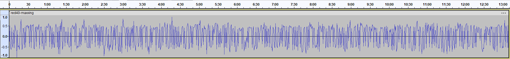
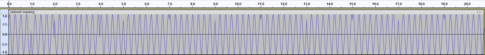
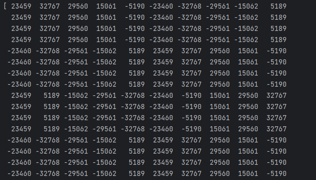
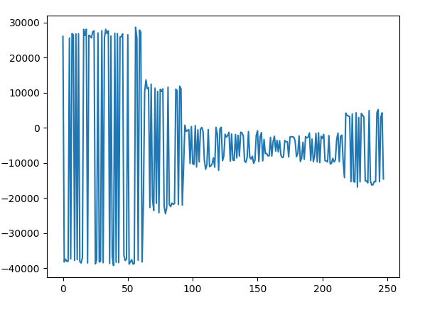
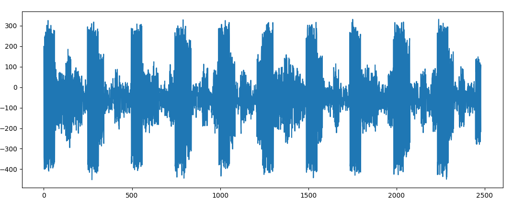
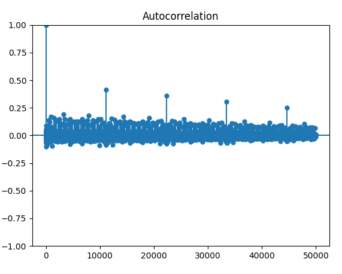
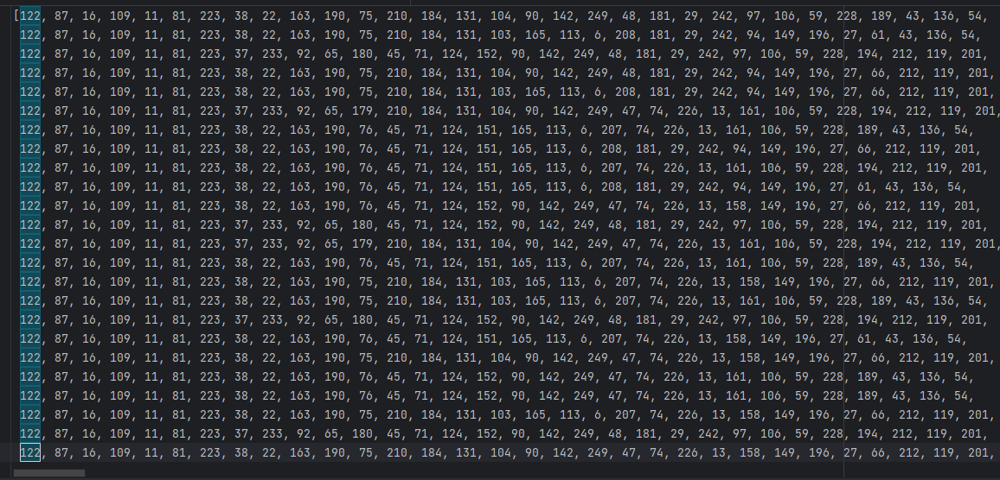

# UMASS CTF 2024 WRITE-UP

*Written by geza3D.*

This document contains the writeups for **Red40 Maxxing**, **Yellow6 Maxxing** and **Yellow5 Maxxing**. 

***Disclaimer***: I'm not educated in the means of decoding radio signals. I'm completely inexperienced in this field and I lack the proper vocabulary for it. I apologize for that to those who are in this field. However, it will probably make my writeup a lot easier to understand for those who are new to this.

The code, both sources and in this document, will contain comments in it describing what each part does and why. They have been heavily cleaned up, while preserving what they did, when I obtained the flags using them. I did this to make the code reflect my thinking process while I was trying to figure out how to obtain the flag.

___

##  Red40 Maxxing

### Challenge Description

*"I picked up this signal coming from a Bikini Bottom computer, but I have no idea what it means. Can you help me demodulate it? (The signal has been shifted to baseband. There is no audio in this file. The signal contains an english sentence repeated several times, modulated somehow onto the carrier. Enter the key as UMASS{\<some_sentence_here\>}, where everything between the angle brackets has been replaced with the lowercase version of the sentence that was transmitted. Example if Hello_there was transmitted the key would be UMASS{hello_there})."*

### Initial Approaches

So, let's embark on the journey of decoding waves. It may seem daunting at first, but as I will show you, it's easier than it looks.

Let me show you how I went about decoding my first ever radio signal.

Firstly, I started by looking up how a wave file can be read in python, so that I can do something with the data stored in the file.

Secondly, I wanted to plot out the signal, to see if there's some sort of repeating pattern in it. We can use Audacity to get this plot:



I was trying to look for something that was repeating in it but as you can see there's no noticeable pattern in it.

### The Solution

As an experiment, I tried checking what would happen if I took the positive points of the wave as 1 and the negative points of the wave as 0.

I ended up with this code:

```python
import wave
import numpy as np

# Reading the wave file and converting its data points into 16-bit signed integers.
reader = wave.open("red40-maxxing.wav", "rb")
data = reader.readframes(-1)
data = np.fromstring(data, np.int16)
reader.close()

# Converting to ones and zeros. 
# One meaning that the amplitude is positive, zero meaning that the amplitude is negative.
data = [1 if x > 0 else 0 for x in data if x != 0]


# Then taking those 1s and 0s and concatenating them into 8-bit integers, then converting that
# to chars (mapping them into ASCII)
msg = ""
for i in range(0, len(data), 8):
    b = data[i]
    for j in range(1, 8):
        b = b << 1
        b = b | data[i+j]
    msg += chr(b)

print(msg)
```

Output: `Its_not_just_a_boulder_its_a_rockIts_not_just_a_boulder_its_a_rockIts_not_just_a_boulder_its_a_rockIts_not_just_a_boulder_its_a_rock...`

And to my surprise it worked. I had solved my first ever radio signal decoding challenge. I wanted to see how far I can go, so I moved onto the next challenge.

## Yellow6 Maxxing

### Challenge Description

*"I picked up this signal coming from a Bikini Bottom computer, except this one seems like it has twice as much information as the last one. Can you help me demodulate it? (There is no audio in this file. The signal contains an english sentence repeated several times, modulated somehow onto the carrier. Enter the key as UMASS{\<some_sentence_here\>}, where everything between the angle brackets has been replaced with the lowercase version of the sentence that was transmitted. Example if Hello_there was transmitted the key would be UMASS{hello_there})
Hint: This is a qam signal.\*"*

*The hint was added / I noticed the hint after I figured out the solution myself.

### Initial Approaches

This challenge was a bit more difficult than the previous one. Before I did anything, I tried running it through my previous code, but it came back with nonsense. We have something else here.

So, the same as before, let's look at the shape of the wave.



If you have a keen eye for this, you may have spotted how it's encoded but when I was trying to solve it what I saw a clean wave with some distortions sprinkled in at the time points. So, I wrongly assumed that those are what contain the data. I was trying to find a way to mark those locations and then use that to obtain binary data. But when I printed the data points out, I quickly realized that my initial assumption were wrong. We can see in the image bellow that there are different waves starting from those distorted looking points.



It was pretty lucky that the numpy arrays printed out the values like this because it clearly showed that the patterns changed every 40 data points (though, `Wave_read::getFramerate()` will also give us 40 as the frequency but it wasn't intuitive to me what that meant until I figured this out).

Unfortunately, I made the mistake of only looking at the starting numbers. I didn't check the numbers after that. So, my next cracking attempt was to take every 40th value from the array and convert that to binary the same way I did for **Red40 Maxxing**. It's easy to see why that wouldn't work.

### The solution

After looking at the values in the array again I finally noticed that there were not 2 different waves but actually at least 3. So, my next and final approach was to find every unique wave. I wrote a simple script to do that, and I ended up with four unique patterns. Now, it's rather easy to conclude that it was encoded in quaternary where the different waves represented either 0, 1, 2 or 3. So I took my unique pattern finding code and gave it some extra logic.

At end, I was looking at this code:

```python
import wave
import numpy as np


# The way I converted the ith occurrence of the wave
# to what it was representing. I was testing out all the
# possible variations, until this one gave me a readable flag.
def remap(i):
    if i == 0:
        return 1
    if i == 1:
        return 0
    if i == 2:
        return 2
    if i == 3:
        return 3


# Reading the wave file and converting its data points into 16-bit signed integers.
reader = wave.open("yellow6-maxxing.wav", "rb")
data = reader.readframes(-1)
reader.close()
data = np.fromstring(data, np.int16)

# Collecting all the unique waves, then collecting their index in the "unique" array in the "data2" array,
# while remapping them to a different number. I could rewrite this to be a lot better, but I want to
# keep the logic of the script as it was when I solved the problem.
freq = 40
data2 = []
unique = []

for i in range(0, len(data)-80, freq):
    s = data[i:i+40]
    b = True
    v = 0
    for j in range(len(unique)):
        u = unique[j]
        if np.array_equal(u, s):
            b = False
            data2.append(remap(j))
            break
    if b:
        unique.append(s)
        data2.append(remap(len(unique)-1))

# Then taking their binary representation, concatenate them into 8-bit integers, then
# converting them to chars. (mapping them into ASCII)
msg = ""
for i in range(0, len(data2)-6, 4):
    b = data2[i]
    for j in range(1, 4):
        b = b << 2
        b = b | data2[i+j]
    msg += chr(b)

print(msg)
```

Output: `Hiiii_KevinHiiii_KevinHiiii_KevinHiiii_KevinHiiii_KevinHiiii_KevinHiiii_Kevin...`

I was rather pleased to see that I was able to crack this one too. With enough determination I was certain that I would be able to solve **Yellow5 Maxxing** as well. However, that one proved to be a lot harder than the previous two.

## Yellow5 Maxxing

### Challenge Description

*"I picked up another signal coming from a Bikini Bottom computer, but this time it is full of noise, it's spectrum is all spreadout. Can you help me demodulate it? (There is no audio in this file. The signal contains an english sentence repeated several times, modulated somehow onto the carrier. Enter the key as UMASS{\<some_sentence_here\>}, where everything between the angle brackets has been replaced with the lowercase version of the sentence that was transmitted. Example if Hello_there was transmitted the key would be UMASS{hello_there}).
Hint: This is a very noisy signal. Autocorrelation might be useful here"*

### Initial Approaches

This is it. Our final challenge of radio signal cracking. With no solves even on the second day of the competition, I was not sure if I'd be able to make it.

So, my first idea with this one was not to plot it with Audacity, since as the description said, it was full of noise. We need a way to get rid of the noise.

So, let's take a look at the length of the data: 447 640. My idea was that if this wave contained a repeating sentence, then it must be repeating in it a whole number of times. After factorizing this number, I wrongly settled on the factor 248. The other notable factor was 31, which we will later see will play a major role in decoding the signal.

Now, the my way of getting rid of the noise was to split up my data into 248 long arrays, and take their average by index (Let me explain what I mean by this: let's take an example: A = [2, 3, 4]; B = [3, 1, 5]; C = [1, 5, 2] and D will contain the averages by index. What this means is that we calculate the elements of D like this: D[i] := (A[i] + B[i] + C[i]) / 3 = AVG(A[i], B[i], C[i]), so for example D[1] = 2). This idea came from how some of my teammates have solved the **Stop the voices** challenge. That challenge had one image that was made unreadable by some added noise. There were many of these noisy images all with different noises, and they needed a way to extract the flag from them. Their approach was to average out all the noisy images to remove the noise and make the flag readable again.

I wrote the code for that, and used matplotlib to plot my result out. Let's look at this plot:



I was looking into way of decoding this. If we look at it, it looks a bit artificial. But other than that, there is nothing repeating in it. Consequently, I went ahead and tried multiples of this. This is what I've gotten when I took 2480 as the length:



This looks more like a pattern. The values between these separator lines are changing, so I quickly jumped to the conclusion that this was the way the message was encoded (And also based on my research it was kind resembling an A.M. signal ([Amplitude Modulation](https://en.wikipedia.org/wiki/Amplitude_modulation))). But this was a dead end again.

### The Solution

Now there was one other thing I forgot to investigate: the hint, which was to use Autocorrelation. If you don't know what this is, don't worry, I didn't either. After researching it for a few hours I've managed to understand what it was on a basic level. So let me explain how I understood it: It takes the signal, then starts shifting (lagging) it with different numbers, and then it checks how similar it is to its unshifted version. 1 means that it's 100% similar, 0 means that it's not similar at all, and -1 means that the signal is the same, but it's mirrored on the x-axis. The values can also be between these points, showing different levels of similarity.

I found a python module that had a function which would plot this autocorrelation out. The issue was that it was taking forever to calculate so I just took a shorter segment of the signal with lags ranging from 0 to its length. I started with small values. First, I saw that it was getting a high similarity value at 248, but I after revisiting that approach, it still yielded no results. I started going for bigger values. Here you can see the plot I've managed to generate:



It's easy to see that it's repeating after every 11160 data points instead of what I initially assumed. So I changed my averaging code to use this new length. This array of values I had now was the actually message.

It's always intuitive to first try the same approaches as before. The **Red40 Maxxing** approach seemed to be a dead end at first since it was printing out almost random characters, but it turned out that those random characters were actually repeating. Since looking at those almost completely random ascii characters was unviable, I just printed them out as unsigned 8-bit integers, instead. Let's look at what those values were after I added enters before the repeating parts:



It looked like it was like **Yellow6 Maxxing** in the sense that different types of lines can be seen. I used my unique pattern finding code again. I guessed the length of the values as 31 (which was also a factor of the whole length of the data), not realizing that it was only the length of the repeating code when they were converted to 8-bit unsigned integers. But it ended up being a good guess because it was also the length of the repeating binary sequences<sup>1</sup>. This time there were 2 unique sequences. I made the first one represent 1 and the second one represent 0.

So, I ended up with this code:

```python
import wave
import numpy as np
import matplotlib.pyplot as plt
from statsmodels.graphics.tsaplots import plot_acf


# A sample length of 50000 with lags ranging from 0 to 50000 makes the repeating pattern pretty obvious,
# while not taking forever to calculate.
def plotAcf(data):
    plot_acf(x=data[:50001], lags=50000)
    plt.show()


# Reading the wave file and converting its data points into 16-bit signed integers.
reader = wave.open("yellow5-maxxing.wav", "rb")
data = reader.readframes(-1)
reader.close()
data = np.fromstring(data, np.int16)

# We split up the data into arrays with the length of the sampleSize, then
# take the average of each index. I do this to try getting rid of the noise.
# I got the sample size using the plot_acf function of statsmodels.
# The plotAcf(data) function plots the autocorrelation for those who are interested.
plotAcf(data)
baseSample = 11160
baseSampleMult = 1
sampleSize = baseSample * baseSampleMult

sampler = [0] * sampleSize
c = 0

for i in range(0, len(data) - sampleSize, sampleSize):
    sample = data[i:i + sampleSize]
    sampler += sample
    c += 1

for i in range(0, len(sampler)):
    sampler[i] /= c

sampler = [1 if x > 0 else 0 for x in sampler]

# We now find the unique sequenced of 1s and 0s, and take their index as our new sequence
# (since there's only two of them).
# Even though, I could swap out the code here to something a lot better
# I'm going to leave it like this since this is how I got my answer, I want to keep
# the core of the logic used intact.
data2 = []
unique = []

for i in range(0, len(sampler), 31):
    s = sampler[i:i + 31]
    b = True
    v = 0
    for j in range(len(unique)):
        u = unique[j]
        if np.array_equal(u, s):
            b = False
            data2.append(j)
            break
    if b:
        unique.append(s)
        data2.append(len(unique) - 1)

# Then taking their binary representation, concatenate them into 8-bit integers, then
# converting them to chars. (mapping them into ASCII)
# Funnily enough, the signal doesn't actually start with the message,
# but it's not that hard to find the start of it.
msg = ""
for i in range(0, len(data2), 8):
    b = data2[i]
    for j in range(1, 8):
        b = b << 1
        b = b | data2[(i + j)]
    msg += chr(b)

print(msg)
```

Output: `nd_meKrusty_Krab_pizza_is_the_pizza_for_you_a`

I was really pleased to see that I've gotten something that was readable. I didn't think I'd be able to make this far.

## Conclusion

I really liked how these challenges were built up. I could clearly categorize them by levels of difficultly. Red40 was the beginner, Yellow6 was the intermediary, and Yellow5 was the expert level. It made it really smooth for people who never had experience with radio signals (including me) to get into this subject and actually learn new things.

Speaking of learning new things. I thought radio waves were a topic I would never understand nor be able to get data out of, but I was proven wrong. This exercise made me put some research into the field, and it really raised my interest for it. I never even considered how this invisible world around us works, and now I have a much greater appreciation for it.

## Notes and extras

<sup>1</sup>After I thought this through, I came to the realization that the two were the same length, because of a simple mathematical coincidence. Let's look at how long of a binary sequence would represent 31 8-bit unsigned integers? 31\*8. Now, let's go the other way around. Let's say we have bit sequences with the length of 31. How many of them do we need to get a whole number of 8-bit unsigned integers out of them? Well, we need 8 bits to form one number, so we just need a multiple of 31 that is divisible by 8. Since, 31 is a prime, we can easily conclude that we need 31\*8 of them. The exact same value we have just gotten, starting from the other end. I thought I will explain this coincidence because I thought it was really interesting.
